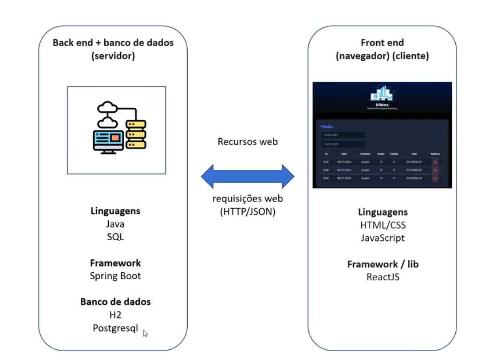

## Imagem Overview do projecto Frontend e Backend

## 🛠 Imagem do Projeto

## Deploy 
https://dslist-java.onrender.com/swagger-ui/index.html

obs: o projeto está hospedado no render gratuito demora um pouco para rodar 

## Modelo de domínio DSList

## H2 Console testing Database
.jpeg)

## 🛠 Tecnologias utilizadas

- **[Java 17]**
- **[Spring Boot]**
- **[JPA / Hibernate]**
- **[Maven]**
- **[H2]**
- **[Postman]**
- **[springdoc]**
- **[postgresql]**
- **[cors]**
  
## Como executar o projeto 

Pré-requisitos: Java 17

 # clonar repositório
git clone https://github.com/JacquelineCasali/dslist-java

# entrar na pasta do projeto back end
cd dslist
cd backend

# executar o projeto cpm
./mvnw spring-boot:run

Autor:Amós Laurindo

https://www.linkedin.com/in/jaquelinecasali/

